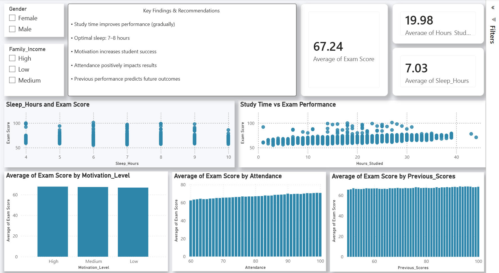

# Student Performance Analysis Dashboard | Power BI

## 📊 Overview
This project analyzes student performance and explores the key factors that may influence exam scores. The dashboard was built using Power BI to provide an interactive and visual analysis of study habits, attendance, sleep, motivation, and previous academic performance.

## 🔍 Key Insights
- Average Exam Score: **67.24**
- Average Study Time: **19.98 hours**
- Average Sleep Duration: **7.03 hours**
- Study time shows a gradual positive relationship with exam performance.
- Higher attendance is associated with better exam results.
- Previous academic performance is a useful indicator of current performance.
- Motivation level also contributes to student performance.

## 📈 Dashboard Features
- Exam Score KPI
- Average Study Hours KPI
- Average Sleep Hours KPI
- Study Time vs Exam Performance analysis
- Sleep Hours vs Exam Score analysis
- Attendance analysis
- Motivation Level analysis
- Previous Scores analysis
- Interactive Gender and Family Income filters

## 🛠 Tools Used
- Power BI
- Data Cleaning
- Data Analysis
- Data Visualization

## 📁 Project File
The Power BI `.pbix` file is included in this repository for further exploration.
